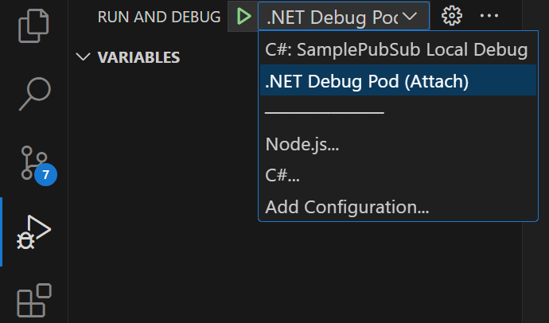
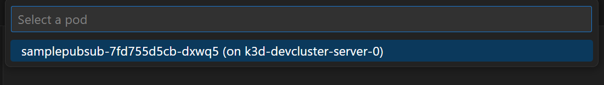

# Azure Edge Extensions AIO - Inner Developer Loop: MQ Dapr Pluggable Component .NET Sample

This sample contains the setup of an inner developer loop to work with **Azure IoT Operations (AIO)** and custom application using Dapr and .NET.
The repo is using a configuration with Visual Studio Code, Dev Container and VS Code Kubernetes Tools to allow local developer environment configuration and remote debugging of workloads.
The sample workload is using .NET, though the same debugging experience can be achieved with other languages.

> Note: [Azure IoT Operations](https://learn.microsoft.com/en-us/azure/iot-operations/) is currently in PREVIEW and subject to change. This sample might stop working at any time due to changes in the PREVIEW.

## Features

This project framework provides the following features:

* A Visual Studio Dev Container with the required developer tools and Visual Studio extensions (.NET, PowerShell, Azure CLI, K9s, MQTTUI, Mosquitto client tools)
* Dev Container is initialized with K3D Kubernetes cluster, a local K3D container registry, and pre-installed Dapr on the cluster
* Script for Azure Arc enabling the local cluster
* Script for deploying Azure IoT Operations
* Sample .NET application leveraging Dapr PubSub Pluggable component to subscribe and publish
* Scripts to build and deploy the custom application into the cluster
* Sample deployment of custom workload and cross namespace TLS validation to AIO MQ
* Scripts to reset the dev container K3D cluster to a clean state and delete the related Azure resources

## Getting Started

### Prerequisites

* Visual Studio Code
* Docker
* [Dev container support in Visual Studio Code](https://code.visualstudio.com/docs/devcontainers/tutorial)
* Azure account with permissions to provision new resources, query the Azure Resource Graph and create Service Principals

### Installation

1. Clone this repository on your local machine
2. `cd azure-edge-extensions-aio-dapr-net-devcontainer-k3d`
3. Open the project in Visual Studio Code `code .`
4. Open the Command palette in Visual Studio Code
5. Choose the option `Dev Containers: Reopen in container`
6. Once the setup has been initialized, the dev container will have initialized K3D Kubernetes cluster with a local container registry for development purposes, and have Dapr runtime pre-installed. The environment is now ready for initializing Azure IoT Operations and Azure Arc. The container registry is available inside the dev container and inside the K3D cluster under `k3d-devregistry.localhost:5500`

### Quickstart: Deploying up Azure IoT Operations

* Open a PowerShell terminal to run all of the following scripts
* Login into your Azure tenant and set a default subscription

```powershell
az login # optionally add --tenant "<tenant_id>"
az account set --subscription "mysubscription_name_or_id"
az account show
```

* Run the following script to connect the K3D Kubernetes cluster to Azure Arc, and enter your choice of cluster name, resource group and location. Ensure that for the parameter `Location` you use one of the [supported regions](https://learn.microsoft.com/en-us/azure/iot-operations/get-started/quickstart-deploy?tabs=linux)

```powershell
 ./devsetup/1-arc.ps1 -ClusterName <cluster_name> -ResourceGroupName <resource_group_name> -Location <location>

 # For example:
 # ./devsetup/1-arc.ps1 -ClusterName arck-myrun-039878 -ResourceGroupName rg-myrun-039878 -Location northeurope
```

* Provision an Azure Key Vault, Key Vault CSI Driver and Azure IoT Operations with the default settings and a Simulated OPC PLC using Azure CLI `az iot ops init` command. The script also provisions an MQ non-TLS `BrokerListener` for development purposes exposed through the Kubernetes service `aio-mq-custom-svc` through use of a `Custom Resource`. Please be patient as this deployment can take more than **15 minutes**

```powershell
 ./devsetup/2-aio.ps1 -ClusterName <cluster_name> -ResourceGroupName <resource_group_name> -KeyVaultName <your_key_vault_name>

 # For example:
 # ./devsetup/2-aio.ps1 -ClusterName arck-myrun-039878 -ResourceGroupName rg-myrun-039878 -KeyVaultName kv-myrun-039878
```

* In addition to AIO default installation, this script also updates the default TLS-enabled `BrokerListener` to include additional DNS entries for MQ using *Custom Resources*. Because further below the sample application is deployed into its own Kubernetes namespace `sample-app`, the above script also ensures this namespace exists and the MQ TLS CA root of trust in the ConfigMap `aio-ca-trust-bundle-test-only` is copied into this new application namespace. This ensures that MQTT clients, such as the `SamplePubSub` in this repo, are able to validate the certificate chain when connecting to the MQ broker with a typical DNS entry in Kubernetes like `<APP>.<NS>.svc.cluster.local`. You can review the YAML file [listener-dns.yaml](./devsetup/yaml/listener-dns.yaml) to see the MQ broker *Custom Resource* configuration to enable this
* This is a one-time setup and you are now ready to develop your custom modules and debug them on the cluster using VS Code Kubernetes Tools

## Demo: Debugging C# Sample PubSub with Dapr Pluggable Component to AIO MQTT Broker

The sample application found in the folder `/src/csharp/SamplePubSub/` is a .NET application which leverages Dapr PubSub with Azure IoT Operations' MQ service to subscribe and publish messages. You can debug this application within the environment by leveraging [VS Code Kubernetes Tools - Debugging](https://github.com/vscode-kubernetes-tools/vscode-kubernetes-tools/blob/master/debug-on-kubernetes.md), which is already pre-installed and configured within the Dev Container.

The Dockerfile used to build the container image for the pod is configured to include the required [debugging tools](https://github.com/vscode-kubernetes-tools/vscode-kubernetes-tools/blob/master/debug-on-kubernetes.md#6-dotnet-debugging). The `dev.Dockerfile` for development and debugging purposes can be reviewed here: [dev.Dockerfile](./src/csharp/SamplePubSub/dev.Dockerfile).

In a production environment you would not use this version of the Dockerfile, as it includes debug tools installed on the container. There is a sample production Dockerfile sample [here](./src/csharp/SamplePubSub/Dockerfile).

### Building, Deploying and Debugging the Application

Several scripts allow you to automate the process, all of which can be found in the folder `./src/csharp/deploydebug`.

1. First start by reviewing the code in the project under `./src/csharp/SamplePubSub/`.
2. Review the YAML which deploys the Dapr component, the sample application and a Service: [`.src/csharp/deploydebug/yaml/samplepubsub.yaml`](src/csharp/deploydebug/yaml/samplepubsub.yaml).
3. Build the docker container for the application:

    * Open a new terminal Window with PowerShell if not yet open.
    * Run the following to build the docker image and push it to the local Docker registry in the K3D cluster. For the parameter `Version` you can use what you like, and normally increase the version with every build.

    ```powershell
     ./src/csharp/deploydebug/build.ps1 -Version 0.1 
    ```

    * Deploy the Pod, Dapr Component and Service to the cluster by running the following script. Note that the `Version` matches an existing image tag that you have built before. The deployment will use the namespace `azure-iot-operations` by default as this is currently ensuring the application is in the same namespace as AIO components.

    ```powershell
    ./src/csharp/deploydebug/deploy.ps1 -Version 0.1
    ```

    * Validate the pod is running:

        ```powershell
        kubectl get pod -n sample-app | Select-String "samplepubsub"

        samplepubsub-544d879c58-bfr8z                   3/3     Running   0               17s
        ```

4. Now that the application is running you can debug it by using the Debug Launcher. The configuration is already done and can be reviewed in `.vscode/settings.json` and `.vscode/launch.json` files.
5. Set the Kubernetes default namespace context to `sample-app` by running `kubectl config set-context --current --namespace=sample-app`.
6. Choose the Run and Debug icon in the VS Code left bar, and pick **.NET Debug Pod (Attach)**
 
7. Start debugging (F5).
8. The Pod Selector will pop up. Select the pod `samplepubusub-xxx`. 

### Debugging Flow with AIO MQTT Broker Messages

1. Ensure debug session is still active. Add a new breakpoint in the file `src/csharp/SamplePubSub/Controllers/MessagesTransformerController.cs`, under the function `MessageReceived` so you can debug messages coming in.
1. Start a new terminal window using bash or PowerShell as preferred.
1. Run MQTTUI to view messages on the MQ: `mqttui`. This command will connect to the default MQTT server at `localhost` port `1883` which is being forwarded from the cluster to your Dev Container. Leave this terminal window running.
1. Open yet another terminal window.
1. Publish a message to the MQ (in the second terminal): `mqttui publish "messages" '{"content":"Hello world","tag":"this is 1"}'`.
1. You should now see the debug console and you can debug as desired based on breakpoints in your code.
1. After debugging through the function, go back to your Terminal window where `mqttui` is running and you should see the original message as well as a copy of the message under the topic `outmessages`.
1. Stop debugging when done (Shift + F5).

### Update Application and Deploy New Version to Debug

Anytime you are doing code changes you can repeat the process to build and deploy a new version of the code and pod to debug again. The version of the deployed container needs to match the source code on your machine.

To do this, you will can iteratively build a new version and deploy it using the convenience scripts.

1. Build the new version ` ./src/csharp/deploydebug/build.ps1 -Version 0.2 `.
1. Deploy the new version ` ./src/csharp/deploydebug/deploy.ps1 -Version 0.2 `.
1. By applying a new docker image reference in the YAML file, the old version of the pod will be terminated and a new version runs.
1. From here you can debug again as before, now debugging new code.

To remove the Sample Application pod deployment completely from the Kubernetes cluster you can run the clean-up script.

```powershell
./src/csharp/deploydebug/cleanup.ps1 -Version 0.1
```

## Clean-up Environment, Azure Resources and Reset Dev Container

Whenever you want to start again with a new K3D registry, K3D cluster, Dapr installed on cluster, Azure Arc and AIO components in both Azure and local cluster, you can run the PowerShell script `devsetup/0-cleanup.ps1`.

```powershell
./devsetup/0-cleanup.ps1 -ResourceGroupName <resource_group_name>
```

This deletes all Azure resources (Resource Group, Azure Arc, Key Vault). It also deletes the K3D container registry and cluster, and then re-creates the registry and K3D cluster once again. From here you can follow the [initial steps](#quickstart-deploying-up-azure-iot-operations) again.

## Resources

* [Azure IoT Operations Official Documentation](https://learn.microsoft.com/en-us/azure/iot-operations/)
* [AIO MQ Broker - Secure MQTT Endpoints](https://learn.microsoft.com/en-us/azure/iot-operations/manage-mqtt-connectivity/howto-configure-brokerlistener)
* [Manage secrets for your Azure IoT Operations deployment](https://learn.microsoft.com/en-us/azure/iot-operations/deploy-iot-ops/howto-manage-secrets)
* [Azure IoT Operations - Use Dapr to develop distributed application workloads](https://learn.microsoft.com/en-us/azure/iot-operations/develop/howto-develop-dapr-apps) - covers MQ's Dapr PubSub and StateStore Pluggable components
* [Recommended sibling repo: Azure Edge Extensions AIO IaC Terraform](https://github.com/Azure-Samples/azure-edge-extensions-aio-iac-terraform)
